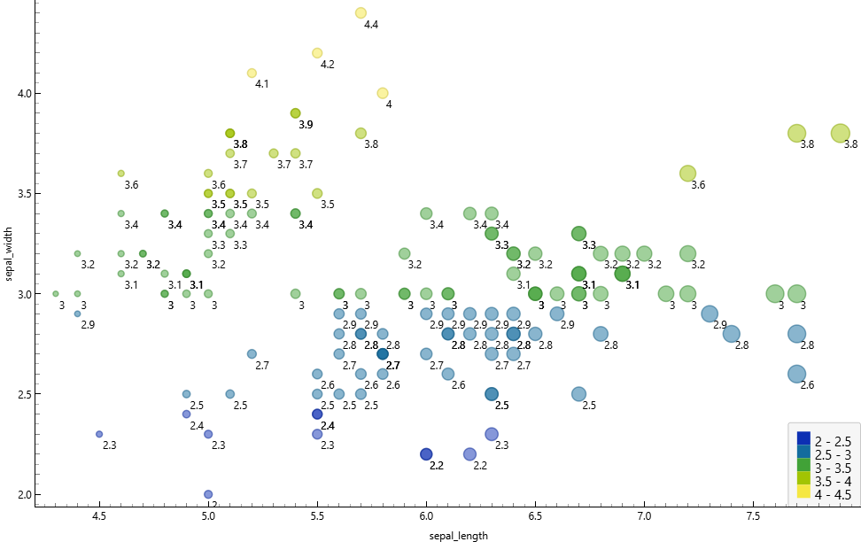
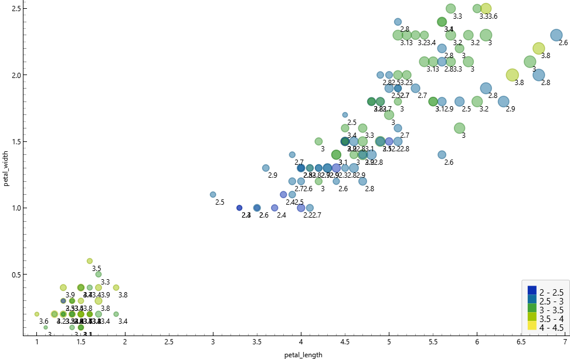
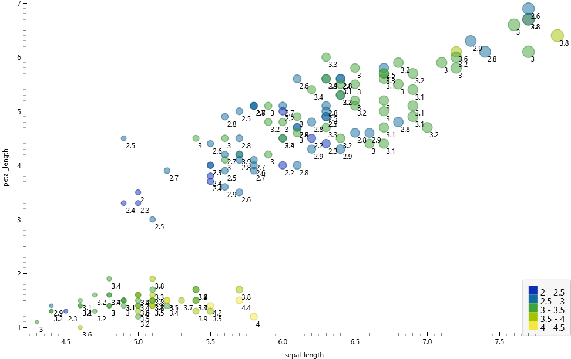
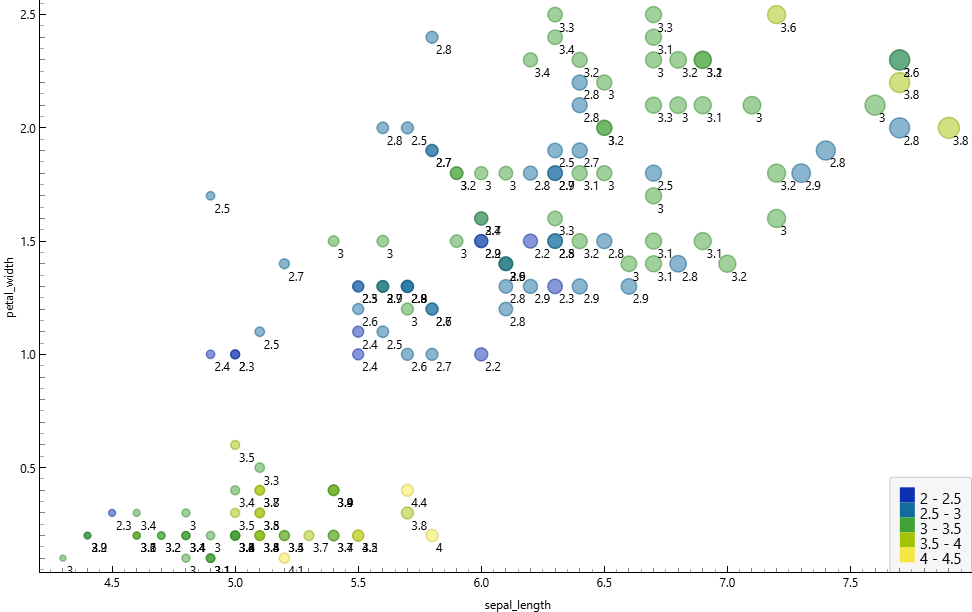
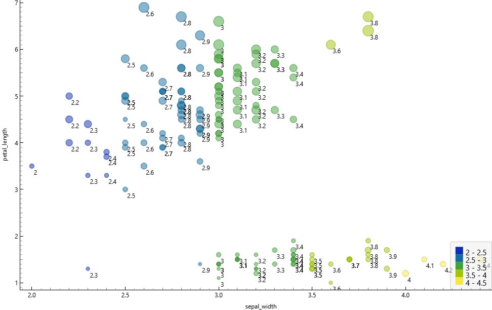
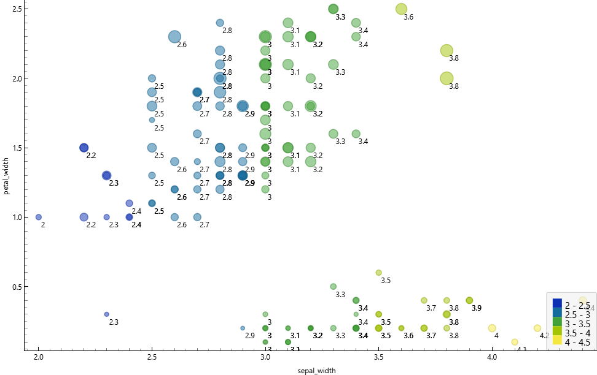

# Data Understanding

## Tugas Pertama

### Korelasi antara sepallength dan sepalwidth

Dari gambar di atas menunjukkan bahwa korelasi antara sepal_length pada sumbu horizontal dan sepal_width pada sumbu vertikal secara keseluruhan terlihat cukup lemah dan menyebar. Berbeda dengan pola linear yang kuat, titik-titik data pada grafik ini tidak membentuk garis lurus yang rapat dari kiri bawah ke kanan atas, yang berarti bertambah besarnya nilai sepal_length tidak selalu berbanding lurus dengan bertambahnya nilai sepal_width. Meskipun korelasi keseluruhannya lemah, kita bisa melihat adanya pengelompokan atau cluster data yang sangat jelas dan tidak menyebabkan ambigu. Di area kiri atas, terdapat sekumpulan titik data yang didominasi warna kuning dan hijau muda, menunjukkan nilai sepal_width yang tinggi berkisar antara 3.4 hingga 4.4, namun memiliki sepal_length yang cenderung pendek yakni di bawah 5.5. Sementara itu, di bagian tengah hingga kanan bawah terdapat kumpulan data yang jauh lebih menyebar dengan dominasi warna biru dan hijau tua, yang merepresentasikan nilai sepal_width lebih rendah antara 2.0 hingga 3.4 tetapi membentang dengan sepal_length yang jauh lebih panjang hingga melebihi angka 7.5. Pemisahan cluster yang sangat kontras ini kemungkinan besar merepresentasikan spesies bunga iris yang berbeda, di mana kelompok kiri atas dengan sepal lebar namun pendek biasanya merupakan karakteristik khas dari spesies Iris setosa yang terpisah jelas dari spesies lainnya. Visualisasi ini juga dibuat semakin informatif melalui penggunaan warna yang memperjelas rentang kategori nilai sepal_width sesuai dengan legenda di sudut kanan bawah, serta pemanfaatan ukuran titik lingkaran yang tampak semakin membesar seiring dengan bertambahnya posisi titik ke arah kanan.

### Korelasi antara petallengt dan petalwidth 

Dari gambar di atas menunjukkan bahwa korelasi antara petal_length pada sumbu horizontal dan petal_width pada sumbu vertikal sangat kuat dan positif. Hal ini dikarenakan titik-titik data membentuk pola garis yang sangat jelas membentang dari arah kiri bawah ke kanan atas, menunjukkan bahwa semakin besar nilai petal_length, maka secara konsisten akan diikuti dengan semakin besarnya pula nilai petal_width. Artinya, kedua variabel tersebut sangat rapat membentuk pola linear yang berbanding lurus. Dari sebaran data ini juga terlihat sangat jelas terdapat dua cluster utama yang terpisah cukup jauh dan sama sekali tidak menyebabkan ambigu. Di area pojok kiri bawah, terdapat sebuah cluster yang sangat terisolasi dengan nilai petal_length yang pendek (berkisar 1 hingga 2) dan petal_width yang sempit (berada di bawah angka 0.7), yang didominasi oleh titik berwarna hijau muda dan kuning. Sementara itu, kelompok data kedua membentang dari area tengah terus naik hingga ke kanan atas, memiliki nilai panjang dan lebar petal yang jauh lebih besar serta didominasi oleh warna biru hingga hijau tua. Pemisahan ruang kosong yang sangat tegas antara cluster kecil di kiri bawah dengan kelompok besar di atasnya ini kemungkinan besar merepresentasikan spesies bunga iris yang berbeda secara morfologi dan sangat mudah untuk diklasifikasikan. Sama seperti sebelumnya, visualisasi ini juga dilengkapi dengan variasi ukuran titik dan rentang warna yang memberikan informasi tambahan mengenai dimensi data lainnya sesuai dengan legenda di sudut kanan bawah.

### Korelasi antara sepallength dan petallength

Dari gambar di atas menunjukkan bahwa korelasi antara sepal_length pada sumbu horizontal dan petal_length pada sumbu vertikal bernilai positif dan terbilang cukup kuat. Hal ini terlihat dari titik-titik data yang membentuk pola diagonal melintang dari arah kiri bawah menuju kanan atas, yang mengindikasikan bahwa pertambahan panjang pada sepal secara umum berbanding lurus dengan pertambahan panjang pada petal. Dari persebaran data tersebut, kita kembali disuguhkan dengan pemandangan dua cluster utama yang terpisah dengan sangat tegas dan sama sekali tidak menyebabkan ambigu. Di area paling bawah, terdapat sebuah kelompok data mendatar yang memiliki sepal_length bervariasi antara kisaran 4.0 hingga hampir 6.0, namun memiliki petal_length yang stagnan dan sangat pendek di kisaran angka 1 hingga 2. Menariknya, cluster bawah ini sangat didominasi oleh titik-titik berwarna kuning dan hijau muda, yang menurut legenda di sudut kanan bawah menandakan dimensi data pelengkapnya bernilai tinggi. Sebaliknya, kelompok data yang lain tersebar membentang menanjak dari area tengah hingga memuncak di kanan atas, merepresentasikan karakteristik bunga dengan ukuran sepal dan petal yang jauh lebih panjang, yang umumnya diwarnai oleh gradasi biru hingga hijau tua. Jarak kosong yang memisahkan kelompok bawah yang mendatar dengan kelompok atas yang menanjak ini kembali menjadi indikator kuat yang merepresentasikan perbedaan spesies bunga iris yang sangat spesifik. Visualisasi ini pun tetap konsisten memanfaatkan variasi warna dan ukuran lingkaran untuk memberikan kedalaman informasi tambahan dalam satu pandangan mata secara komprehensif.

### Korelasi antara sepallength dan petalwidth

Dari gambar di atas menunjukkan bahwa korelasi antara sepal_length pada sumbu horizontal dan petal_width pada sumbu vertikal bernilai positif dan terlihat cukup kuat. Hal ini terlihat dari titik-titik data yang membentuk pola pergerakan menanjak dari arah kiri bawah menuju kanan atas, yang mengindikasikan bahwa semakin bertambahnya panjang sepal, maka cenderung akan diikuti pula dengan peningkatan ukuran lebar pada petal. Dari persebaran data tersebut, kita kembali dapat melihat dengan jelas adanya dua cluster utama yang terpisah secara tegas dan tidak menyebabkan ambigu. Di area paling bawah, terdapat sebuah kelompok data yang menggerombol dengan nilai petal_width yang sangat sempit di bawah angka 0.7, serta sepal_length yang berada di kisaran 4.3 hingga 5.8. Menariknya, cluster bagian bawah ini kembali didominasi oleh titik-titik berwarna kuning dan hijau muda, yang merujuk pada legenda di sudut kanan bawah sebagai penanda bahwa dimensi data pelengkapnya (sepal_width) bernilai cukup tinggi. Sementara itu, kelompok data yang kedua tersebar jauh lebih luas dan menanjak dari area tengah hingga memuncak di kanan atas, merepresentasikan karakteristik bunga dengan ukuran panjang sepal dan lebar petal yang jauh lebih besar, serta umumnya diwarnai oleh gradasi biru hingga hijau tua yang menandakan ukuran sepal_width lebih rendah hingga menengah. Jarak kosong yang memisahkan kelompok bawah dengan kelompok atas yang menanjak ini kembali menjadi bukti visual yang sangat kuat untuk merepresentasikan perbedaan spesies bunga iris yang spesifik. Visualisasi scatter plot ini pun tetap konsisten dalam memanfaatkan variasi warna dan ukuran lingkaran untuk menyajikan kedalaman informasi dari berbagai variabel sekaligus secara komprehensif dalam satu tampilan.

### Korelasi antara sepalwidth dan petallength

Dari gambar di atas menunjukkan bahwa korelasi antara sepal_width pada sumbu horizontal dan petal_length pada sumbu vertikal terlihat cenderung menyebar dan terpisah, bahkan bisa dibilang memiliki korelasi negatif yang lemah secara keseluruhan jika ditarik garis lurus. Hal ini terlihat dari titik-titik data yang sama sekali tidak membentuk pola garis linear yang rapi, melainkan terpecah ke dalam ruang yang berbeda. Dari persebaran data tersebut, kita kembali dapat melihat dengan sangat jelas adanya dua cluster utama yang terpisah secara tegas dan tidak menyebabkan ambigu. Di area kanan bawah, terdapat sebuah kelompok data mendatar yang menggerombol padat dengan nilai petal_length yang sangat pendek di kisaran angka 1 hingga 2, namun memiliki sepal_width yang terbilang lebar yakni membentang dari kisaran 3.0 hingga melebihi 4.0. Menariknya, cluster bagian bawah ini sangat didominasi oleh titik-titik berwarna hijau muda dan kuning, yang merujuk pada legenda di sudut kanan bawah memang merepresentasikan tingginya rentang nilai pada kelompok tersebut. Sementara itu, kelompok data yang lain tersebar jauh lebih luas dari area kiri tengah hingga melambung ke atas, merepresentasikan karakteristik bunga dengan ukuran panjang petal yang jauh lebih besar mulai dari angka 3 hingga mendekati 7, namun dengan ukuran sepal_width yang cenderung lebih sempit hingga menengah di kisaran 2.0 hingga 3.4. Kelompok yang melayang di atas ini umumnya diwarnai oleh gradasi biru hingga hijau tua. Ruang kosong vertikal yang sangat kentara dalam memisahkan kelompok bawah yang terisolasi dengan kelompok atas yang menyebar luas ini kembali menjadi bukti visual yang kuat untuk merepresentasikan perbedaan spesies bunga iris yang spesifik secara morfologi. Visualisasi scatter plot ini tetap konsisten menyajikan pengelompokan yang tegas dengan memanfaatkan variasi warna dan ukuran titik untuk memperjelas rentang nilai data secara komprehensif dalam satu tampilan.

### Korelasi antara sepalwidth dan petalwidth

Dari gambar di atas menunjukkan bahwa korelasi antara sepal_width pada sumbu horizontal dan petal_width pada sumbu vertikal secara keseluruhan terlihat menyebar dan terpisah, tidak membentuk korelasi linear yang kuat. Hal ini terlihat dari titik-titik data yang terpecah ke dalam area yang berbeda dan tidak membentuk satu pola garis yang utuh. Dari persebaran data tersebut, kita kembali dapat melihat dengan sangat jelas adanya dua cluster utama yang terpisah secara tegas dan sama sekali tidak menyebabkan ambigu. Di area kanan bawah, terdapat sebuah kelompok data mendatar yang menggerombol padat dengan nilai petal_width yang sangat sempit di kisaran angka 0.1 hingga 0.6, namun memiliki sepal_width yang terbilang lebar yakni membentang dari kisaran 3.0 hingga melebihi 4.0. Menariknya, cluster bagian bawah ini sangat didominasi oleh titik-titik berwarna hijau muda dan kuning, yang merujuk pada legenda di sudut kanan bawah merepresentasikan tingginya rentang nilai pada kelompok tersebut. Sementara itu, kelompok data yang lain tersebar jauh lebih luas menempati area kiri tengah hingga melambung ke atas, merepresentasikan karakteristik bunga dengan ukuran lebar petal yang jauh lebih besar mulai dari angka 1.0 hingga mendekati 2.5, namun dengan rentang ukuran sepal_width yang bervariasi dari sempit hingga menengah di kisaran 2.0 hingga mendekati 3.5. Kelompok yang berada di atas ini didominasi oleh gradasi warna biru hingga hijau tua. Ruang kosong mendatar yang sangat kentara dalam memisahkan kelompok bawah yang terisolasi dengan kelompok atas yang menyebar luas ini menjadi bukti visual terakhir yang sangat kuat untuk merepresentasikan perbedaan spesies bunga iris yang spesifik secara morfologi. Visualisasi scatter plot ini tetap konsisten menyajikan pengelompokan yang tegas dengan memanfaatkan variasi warna dan ukuran titik untuk memperjelas rentang nilai data secara komprehensif dalam satu pandangan.

### statistik deskriptif

Dari gambar tabel Column Statistics tersebut, ditampilkan ringkasan data numerik komprehensif sekaligus visualisasi distribusi histogram untuk empat fitur dimensi bunga iris beserta satu kolom target kategorikal. Seluruh kolom secara konsisten menunjukkan angka nol persen pada bagian missing value, yang mengartikan bahwa dataset ini sepenuhnya utuh dan sangat bersih untuk dilakukan tahap pemodelan lebih lanjut. Kolom sepal_length memiliki rentang nilai terluas yang membentang dari 4.3 hingga 7.9 dengan rata-rata 5.84, sementara sepal_width memiliki sebaran yang lebih memusat pada rentang 2.0 hingga 4.4 dengan nilai median dan modus yang seragam berpusat di angka 3. Hal yang paling menonjol dan menjadi konfirmasi absolut dari rentetan analisis scatter plot sebelumnya terlihat sangat jelas pada visualisasi grafik distribusi untuk variabel petal_length dan petal_width. Pada kedua kolom dimensi kelopak tersebut, grafik distribusinya tidak membentuk kurva normal melainkan terpecah secara ekstrem, di mana terdapat sebuah batang histogram yang menjulang sangat tinggi terisolasi di ujung paling kiri. Batang dominan di sebelah kiri ini merepresentasikan tingginya frekuensi kemunculan data yang menumpuk pada rentang nilai yang sangat rendah, sejalan dengan angka modus petal_length yang anjlok di angka 1.5 dan petal_width di 0.2. Penumpukan frekuensi pada nilai batas bawah ini secara langsung berkorelasi dengan spesies Iris-setosa yang juga tercatat menempati posisi modus pada kolom kategorikal spesies di bagian paling bawah dengan visualisasi tiga blok distribusi yang seimbang. Pola histogram yang terbelah tegas ini secara visual maupun matematis membuktikan keberadaan sebuah cluster terisolasi yang selalu memisahkan diri di area bawah pada grafik-grafik sebaran data sebelumnya, yang mendeskripsikan karakteristik morfologi ukuran kelopak yang jauh lebih kecil dan seragam khusus untuk kelompok spesies Iris-setosa.